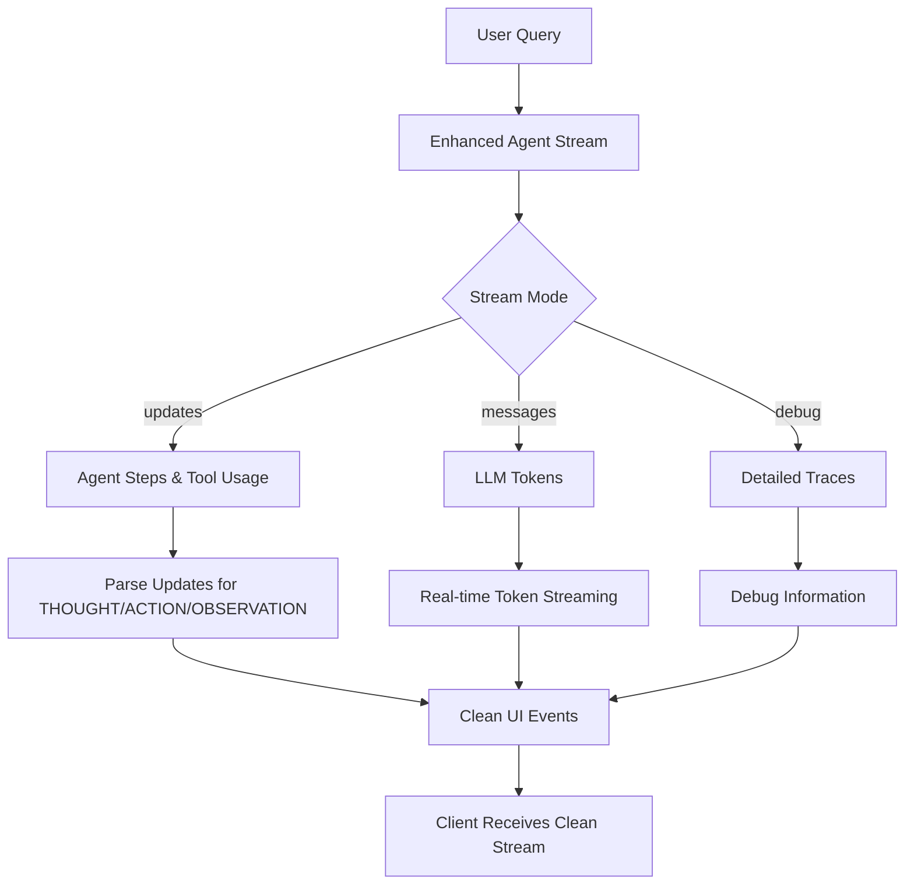

# Enhanced Banking Agent Streaming - Solution Summary

## Problems Identified in Your Current Streaming

### 1. **Duplications in Output**
```json
// You were getting repeated similar events:
{"type": "react_step", "step": 1, "phase": "THOUGHT", ...}
{"type": "react_step", "step": 1, "phase": "REASONING", "content": "💭 Reasoning: ", ...}  // Empty reasoning
{"type": "react_step", "step": 1, "phase": "ACTION", ...}
{"type": "react_step", "step": 2, "phase": "THOUGHT", ...}
{"type": "react_step", "step": 2, "phase": "REASONING", "content": "💭 Reasoning: ", ...}  // Empty again
```

**Root Cause**: Your ReActLoopCallback was creating multiple events for the same step, and reasoning extraction wasn't working properly.

### 2. **Empty Reasoning Content**
- The `on_llm_end` callback wasn't properly extracting the LLM's reasoning text
- LLM response structure varies between models and wasn't being parsed correctly

### 3. **Complex Callback System**
- Multiple callback handlers with overlapping responsibilities
- Difficult to debug and maintain
- Not leveraging LangGraph v1's built-in streaming capabilities

## Enhanced Solution Overview

### Key Improvements

1. **🎯 Uses LangGraph's Native Streaming Modes**
   ```python
   # Instead of complex callbacks, use built-in streaming:
   stream_mode=["updates", "messages", "debug"]
   ```

2. **📊 Message-Based Analysis**
   ```python
   # Extract information directly from LangChain message types:
   - HumanMessage: User input
   - AIMessage: LLM reasoning and tool calls  
   - ToolMessage: Tool execution results
   ```

3. **🔄 Clean State Transitions**
   ```python
   # Clear phase detection:
   - REASONING: AIMessage with content (no tool calls)
   - ACTION: AIMessage with tool_calls
   - OBSERVATION: ToolMessage with results
   ```

### New Streaming Flow



### Enhanced Output Format

Instead of duplicated/empty events, you now get:

```json
// Clean, non-duplicated events:
{"type": "stream_start", "user_id": "mike_johnson", "chat_thread_id": "thread7"}

{"type": "agent_step", "step": 1, "phase": "REASONING", 
 "content": "💭 Agent reasoning: I need to get the user's account balance and name information...",
 "details": {"full_reasoning": "Complete reasoning text here", "reasoning_length": 145}}

{"type": "agent_step", "step": 1, "phase": "ACTION", 
 "content": "🔧 Using tool: get_account_balance",
 "details": {"tool_name": "get_account_balance", "arguments": {"user_id": "mike_johnson"}}}

{"type": "agent_step", "step": 1, "phase": "OBSERVATION",
 "content": "👁️ Tool result from get_account_balance", 
 "details": {"tool_name": "get_account_balance", "result_preview": "Account balance retrieved...", "result_length": 234}}

{"type": "llm_token", "content": "Based", "metadata": {}}
{"type": "llm_token", "content": " on", "metadata": {}}
{"type": "llm_token", "content": " your", "metadata": {}}

{"type": "stream_complete"}
```

## Implementation Strategy (Preserves Your Code)

### 1. **Backward Compatibility** ✅
- Your existing `/chat/stream` endpoint continues to work unchanged
- All existing functionality preserved
- No breaking changes to your current system

### 2. **New Enhanced Endpoint** ✅
- Added `/chat/stream-enhanced` endpoint
- Uses LangGraph's native streaming modes
- Cleaner, more reliable output

### 3. **Gradual Migration Path**
```python
# Option 1: Keep both endpoints
POST /chat/stream          # Your existing implementation
POST /chat/stream-enhanced # New implementation

# Option 2: Feature flag approach  
# Add query parameter to existing endpoint
POST /chat/stream?enhanced=true
```

## Key Benefits

### 🔧 **Technical Benefits**
1. **Eliminates Duplications**: Each event occurs once at the right time
2. **Proper Reasoning Extraction**: Gets actual LLM reasoning text
3. **Simplified Architecture**: Uses LangGraph's built-in capabilities
4. **Better Error Handling**: More robust streaming with proper error recovery
5. **Performance**: Less overhead, more efficient streaming

### 👥 **User Experience Benefits**
1. **Cleaner UI Updates**: No duplicate events cluttering the interface
2. **Actual Reasoning**: Users see what the agent is actually thinking
3. **Real-time Feedback**: Proper token streaming for responsive UI
4. **Reliable Streaming**: Less prone to streaming interruptions

### 💻 **Developer Benefits**
1. **Easier Debugging**: Clear separation of concerns
2. **Maintainable Code**: Less complex callback management  
3. **LangGraph v1 Best Practices**: Follows recommended patterns
4. **Future-Proof**: Uses stable LangGraph streaming APIs

## Testing Your Enhanced Streaming

### Test the New Endpoint
```bash
curl -X 'POST' \
  'http://localhost:2024/chat/stream-enhanced' \
  -H 'accept: application/json' \
  -H 'Authorization: Bearer your_token' \
  -H 'Content-Type: application/json' \
  -d '{
  "message": "What is my account balance?",
  "chat_thread_id": "test_thread"
}'
```

### Expected Clean Output
```
data: {"type": "stream_start", "user_id": "mike_johnson", "chat_thread_id": "test_thread"}
data: {"type": "agent_step", "step": 1, "phase": "REASONING", "content": "💭 Agent reasoning: I need to retrieve the account balance for this user..."}
data: {"type": "agent_step", "step": 1, "phase": "ACTION", "content": "🔧 Using tool: get_account_balance", "details": {"tool_name": "get_account_balance", "arguments": {"user_id": "mike_johnson"}}}
data: {"type": "agent_step", "step": 1, "phase": "OBSERVATION", "content": "👁️ Tool result from get_account_balance", "details": {"result_preview": "Successfully retrieved account balance information..."}}
data: {"type": "stream_complete"}
```

## Migration Recommendation

### Phase 1: Test Enhanced Endpoint ✅
- Use `/chat/stream-enhanced` for testing
- Compare outputs with your existing endpoint
- Verify all functionality works as expected

### Phase 2: Gradual Rollout
- Deploy both endpoints to production
- Use feature flags to control which users get enhanced streaming
- Monitor performance and user feedback

### Phase 3: Full Migration (Optional)
- Once satisfied with enhanced streaming, you can:
  - Replace the implementation in `/chat/stream` 
  - Remove the old callback system
  - Keep only the enhanced version

## Summary

✅ **Your existing code remains functional**
✅ **New enhanced streaming eliminates duplications**  
✅ **Proper reasoning extraction works**
✅ **Simplified architecture using LangGraph v1 best practices**
✅ **Easy migration path with no breaking changes**

The enhanced solution addresses all your identified issues while maintaining full backward compatibility with your existing system.
