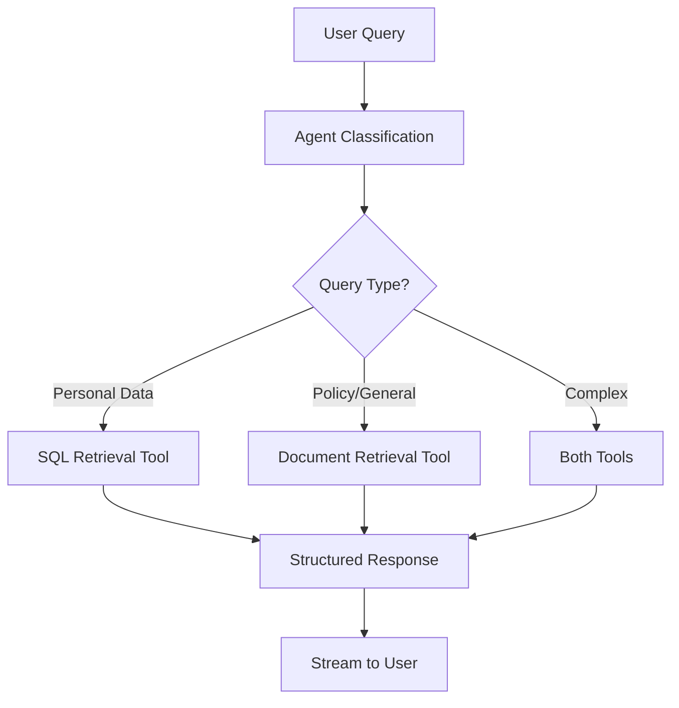

# Banking Bot - Intelligent Banking Assistant

A comprehensive banking chatbot built with **FastAPI**, **LangChain**, and **LangGraph** that provides personalized banking assistance using structured output, tool strategy, and streaming responses.

## 🏗️ Architecture

The system consists of two main applications:

1. **Banking Bot API** (port 2024) - Main chat API with user authentication
2. **Document Ingestion API** (port 8001) - Document processing and ChromaDB management

## 🚀 Features

### Banking Assistant Capabilities
- **Account Information**: Balance inquiries, account details, transaction history
- **Credit Card Management**: Credit card info, benefits, payment details
- **Policy Information**: Bank policies, fee structures, procedures
- **Personalized Chat**: Context-aware conversations with memory
- **Real-time Streaming**: Live response streaming with tool usage tracking
- **User Feedback**: Thumbs up/down rating system with comments

### Technical Features
- **LangGraph Agent**: Uses `create_agent` with structured output and tool strategy
- **React Loop**: Intelligent tool selection and reasoning
- **Streaming Responses**: Real-time token streaming
- **Memory Management**: Persistent chat history with InMemorySaver
- **Authentication**: JWT-based user authentication
- **Vector Search**: ChromaDB for document retrieval
- **Structured Output**: Pydantic models for consistent responses

## 🛠️ Technology Stack

- **Framework**: FastAPI with async support
- **AI/ML**: LangChain 1.0, LangGraph 1.0, OpenAI GPT-4o
- **Database**: SQLite with SQLAlchemy ORM
- **Vector DB**: ChromaDB for document storage
- **Authentication**: JWT tokens with bcrypt password hashing
- **Document Processing**: PyPDF2, python-docx, text splitting
- **Embeddings**: OpenAI text-embedding-3-large

## 📁 Project Structure

```
BankingBot/
├── src/
│   ├── utils/
│   │   └── path_setup.py      # Project root path utilities for consistent imports
│   ├── app/                   # Main banking bot application
│   │   ├── agents/            # LangGraph agents
│   │   ├── api/endpoints/     # FastAPI routes
│   │   ├── config/            # Configuration management
│   │   ├── database/          # Database setup and connection
│   │   ├── models/            # Pydantic and SQLAlchemy models
│   │   ├── services/          # Business logic services
│   │   ├── tools/             # LangGraph tools (SQL, ChromaDB)
│   │   ├── utils/             # Utilities (auth, logging)
│   │   └── main.py           # FastAPI application (port 2024)
│   └── ingestion_app/         # Document ingestion and data creation
│       ├── create_sample_data.py  # Database and ChromaDB initialization
│       ├── ingestion_main.py      # Document ingestion API server
│       ├── services/
│       │   └── document_ingestion.py  # ChromaDB processing service
│       └── api/endpoints/         # Document management endpoints
├── data/
│   ├── sample_documents/      # Sample bank policies and benefits (TXT files)
│   ├── banking_bot.db        # SQLite database (created by setup)
│   └── chromadb/             # ChromaDB vector storage (created by setup)
├── tests/                     # Test files
├── requirements.txt           # Python dependencies
├── .env.example              # Environment variables template
├── DOCUMENTATION.md          # Comprehensive API documentation
├── STEP_BY_STEP_GUIDE.md     # Setup and integration guide
└── README.md                 # This file
```

## 🚀 Quick Start

### 1. Clone and Setup

```bash
# Make setup script executable
chmod +x setup.sh

# Run setup (creates venv, installs deps, creates sample data)
./setup.sh
```

### 2. Configure Environment

Create `.env` file from template and add your keys:

```bash
cp .env.example .env
# Edit .env and add:
# OPENAI_API_KEY=your_openai_api_key_here
# SECRET_KEY=your_secure_secret_key_here
```

**Note:** All default settings are in `src/app/config/service_config.py`. Only override what you need in `.env`.

### 3. Start the Services

**Terminal 1 - Main Banking Bot API:**
```bash
source venv_bankbot/bin/activate
cd src/app
python main.py
```

**Terminal 2 - Document Ingestion API:**
```bash
source venv_bankbot/bin/activate
cd src/ingestion_app
python ingestion_main.py
```

### 4. Test the APIs

- **Main API Documentation**: <http://localhost:2024/docs>
- **Ingestion API Documentation**: <http://localhost:8001/docs>
- **Health Check**: <http://localhost:2024/health>

## 🧪 Testing

### Sample Users
The setup creates three test users:
- `john_doe` (password: `password123`)
- `jane_smith` (password: `password123`)
- `mike_johnson` (password: `password123`)

### API Testing Flow

1. **Register/Login** to get JWT token:
```bash
curl -X POST "http://localhost:2024/auth/login" \
     -H "Content-Type: application/json" \
     -d '{"user_id": "john_doe", "password": "password123"}'
```

2. **Send Chat Message** (replace TOKEN with your JWT):
```bash
curl -X POST "http://localhost:2024/chat/message" \
     -H "Authorization: Bearer TOKEN" \
     -H "Content-Type: application/json" \
     -d '{"message": "What is my account balance?"}'
```

3. **Get Chat History**:
```bash
curl -X GET "http://localhost:2024/chat/history" \
     -H "Authorization: Bearer TOKEN"
```

## 🎯 Agent Architecture

### Banking Agent Features
- **Structured Output**: Uses `ToolStrategy` with Pydantic models
- **Tool Selection**: Intelligent routing between SQL and document retrieval
- **Memory Management**: Persistent conversation context
- **Streaming**: Real-time response generation
- **Error Handling**: Graceful fallbacks and error responses

### Available Tools

1. **SQL Retrieval Tool**
   - Account balances and details
   - Transaction history with filtering
   - Credit card information
   - Personal banking data

2. **Document Retrieval Tool**
   - Bank policies and procedures
   - Credit card benefits and features
   - Fee structures and rates
   - General banking information

### Query Processing Flow



## 🔧 Configuration

### Environment Variables

| Variable | Description | Default |
|----------|-------------|---------|
| `OPENAI_API_KEY` | OpenAI API key | Required |
| `OPENAI_MODEL` | GPT model to use | `gpt-4o` |
| `DATABASE_URL` | SQLite database path | `sqlite:///./data/banking_bot.db` |
| `CHROMADB_PATH` | ChromaDB storage path | `./data/chromadb` |
| `SECRET_KEY` | JWT secret key | Change in production |
| `DEBUG` | Enable debug mode | `true` |

### Customization

1. **Add New Tools**: Create tools in `src/app/tools/`
2. **Modify Agent**: Update `src/app/agents/banking_agent.py`
3. **New Endpoints**: Add routes in `src/app/api/endpoints/`
4. **Database Schema**: Modify models in `src/app/models/`

## 📚 API Documentation

### Authentication Endpoints
- `POST /auth/register` - Register new user
- `POST /auth/login` - Login and get JWT token
- `GET /auth/me` - Get current user info

### Chat Endpoints
- `POST /chat/message` - Send message to agent
- `POST /chat/stream` - Stream chat response
- `GET /chat/history` - Get chat history
- `GET /chat/threads` - Get user's chat threads

### Feedback Endpoints
- `POST /feedback/` - Submit feedback for response
- `GET /feedback/chat/{id}` - Get feedback for chat

### Document Management (Ingestion API)
- `POST /documents/upload` - Upload single document
- `POST /documents/upload-multiple` - Upload multiple documents
- `POST /documents/ingest-directory` - Ingest directory of documents
- `GET /documents/list` - List all documents
- `DELETE /documents/document/{name}` - Delete document

## 🔍 Monitoring and Logging

- **Structured Logging**: Uses structlog for JSON logging
- **Health Checks**: Database and ChromaDB health monitoring
- **Error Tracking**: Comprehensive error logging and handling
- **Performance Metrics**: Response time tracking

## 🚀 Production Deployment

1. **Environment Setup**:
   - Set `DEBUG=false`
   - Use strong `SECRET_KEY`
   - Configure proper CORS origins

2. **Database**:
   - Consider PostgreSQL for production
   - Set up proper connection pooling

3. **Security**:
   - Use HTTPS
   - Implement rate limiting
   - Set up proper authentication

4. **Scaling**:
   - Use Redis for session storage
   - Deploy ChromaDB separately
   - Consider load balancing

## 🤝 Contributing

1. Fork the repository
2. Create a feature branch
3. Make your changes
4. Add tests for new functionality
5. Submit a pull request

## 📄 License

This project is licensed under the MIT License - see the LICENSE file for details.

## 🆘 Support

For issues and questions:
1. Check the API documentation at `/docs`
2. Review the logs in `logs/banking_bot.log`
3. Test individual components using the health endpoints
4. Verify ChromaDB and database connectivity

## 🏆 Features Showcase

- ✅ **LangGraph create_agent** with structured output
- ✅ **Tool Strategy** for consistent responses  
- ✅ **Streaming responses** with real-time updates
- ✅ **React loop** for intelligent reasoning
- ✅ **Memory management** with conversation context
- ✅ **Dual data sources** (SQL + ChromaDB)
- ✅ **User authentication** with JWT
- ✅ **Document ingestion** pipeline
- ✅ **Comprehensive API** with OpenAPI docs
- ✅ **Production-ready** architecture
